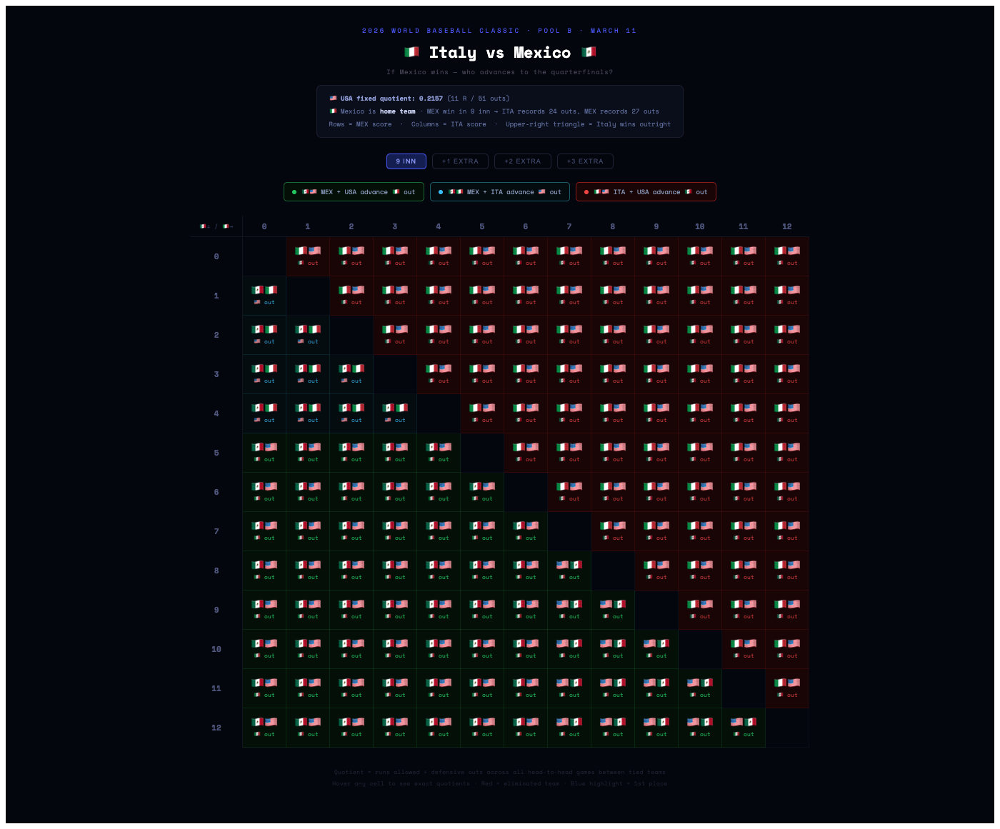

# WBC 2026 Pool B Odds — Italy vs Mexico

Interactive matrix showing who advances to the WBC 2026 quarterfinals based on the final score of the Italy vs Mexico game (March 11, 2026).

## Context

After Italy upset USA 8-6, all three top teams finished 3-1 if Mexico beats Italy. The tiebreaker is **runs allowed ÷ defensive outs** in head-to-head games between the tied teams.

### Fixed USA quotient (completed games)
- vs Mexico: allowed 3 runs in 24 outs
- vs Italy: allowed 8 runs in 27 outs
- **Total: 11 runs / 51 outs = 0.2157**

### Italy vs Mexico (March 11)
- **Mexico is home team** → if Mexico wins in 9 inn: Italy records 24 outs, Mexico records 27 outs

## 9-Inning Game Matrix 



- **Rows** = Mexico score
- **Columns** = Italy score
- **Diagonal** = blank (ties impossible in baseball)
- **Upper-right triangle** = Italy wins outright → 🇮🇹 ITA + 🇺🇸 USA advance
- **Lower-left triangle** = Mexico wins → tiebreaker determines 🇺🇸 vs 🇮🇹 for 2nd place

## Odds (9 innings, equal probability per scoreline)

| Team | Advances | Finishes 1st |
|------|----------|--------------|
| 🇺🇸 USA | 93.6% | 9.6% |
| 🇲🇽 Mexico | 50.0% | 40.4% |
| 🇮🇹 Italy | 56.4% | 50.0% |

## Getting Started

```bash
npm install
npm run dev
```

Then open the local URL printed in the terminal (default: http://localhost:5173)
